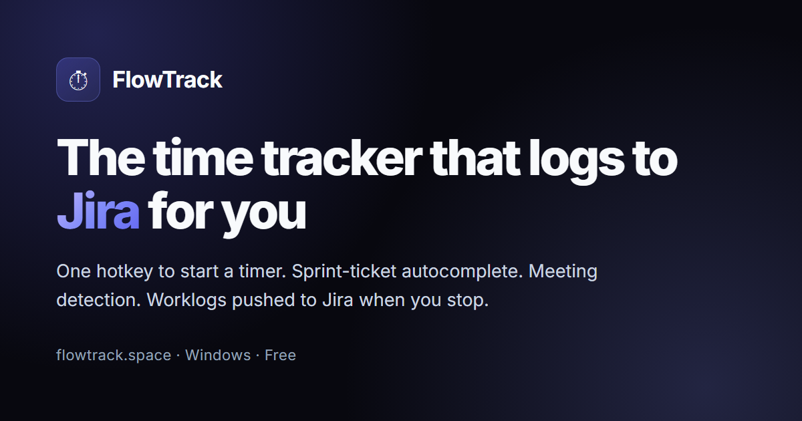

# ⏱ FlowTrack

**A Windows desktop time tracker that logs to Jira for you.**

One hotkey to start a timer · sprint-ticket autocomplete · meeting detection ·
worklogs pushed to Jira when you stop.

[**⬇ Download**](https://github.com/harshit9466/flowtrack-releases/releases/latest) ·
[**flowtrack.space**](https://flowtrack.space) ·
[Features](https://flowtrack.space/features.html) ·
[Changelog](https://flowtrack.space/changelog.html)

 

---

This repository hosts the **signed Windows installers** and the **auto-update
manifest** (`latest.json`). The application source is private; issues and feedback
are welcome here or in the app's built-in feedback form.

---

## What it does

**Quick Capture** — Press `Ctrl+Shift+Space` from any app, type part of a ticket
number, hit Enter. The timer's running. No window to find, no mouse.

**Jira integration** — Connect with OAuth (no API token to generate). Sprint
tickets autocomplete as you type; worklogs push back to Jira when you stop a
timer. Editing a session's time updates the existing worklog rather than adding a
duplicate.

**Meeting detection** — For Microsoft Teams, FlowTrack reads meeting state from
the local API Teams exposes (only if you enable Teams' "third-party app API
access"). For Zoom, Google Meet, Webex, and Slack huddles it checks window titles
and process names. **No audio is recorded and no call content is read** — this
runs entirely on your machine.

**Smart nudges** — Reminders for the things people forget: returning from idle,
a timer left running past your work hours, working with no timer, the
end-of-day wrap-up. Every nudge type can be turned off.

**AI assistant (optional)** — Draft session descriptions, end-of-day summaries,
and morning plans from real session data. Six providers: the Claude and OpenAI
APIs, the Gemini API, Claude Code, Antigravity, and a local Ollama model if
you'd rather nothing leave your machine.

**Dashboard & analytics** — Daily totals, session counts, streaks, per-ticket
time, focus vs. meeting load, and CSV export. Sessions group under tasks by
ticket number.

**Auto-updates** — New versions install themselves. Turn it off in settings if
you'd rather update manually.

---

## Install

1. Download the latest `.msi` (or `-setup.exe`) from
   [Releases](https://github.com/harshit9466/flowtrack-releases/releases/latest).
2. Run the installer.
3. Launch FlowTrack from the Start menu — it lives in the system tray.
4. Create an account, then connect Jira from Settings → Integrations.

**Requirements:** Windows 10 or 11, ~100 MB disk, an internet connection for sync.
Future updates install automatically.

---

## Privacy

- All API traffic is HTTPS; data at rest is encrypted with AES-256-GCM.
- Jira tokens and AI API keys are encrypted, never stored in plain text.
- Activity/window-title tracking is **local only** — it never leaves your machine.
- No telemetry, no analytics, no ad tracking.
- You can export your data (CSV) or delete your account (Settings → Profile) at
  any time; deletion removes everything within 30 days.

Full policy: [flowtrack.space/privacy.html](https://flowtrack.space/privacy.html)

---

## Support

Open an [issue](https://github.com/harshit9466/flowtrack-releases/issues), or use
the feedback form inside the app (Settings → Feedback).

 
Built with Tauri 2 (Rust) · React · Spring Boot · PostgreSQL — by <a href="https://github.com/harshit9466">Harshit</a>

